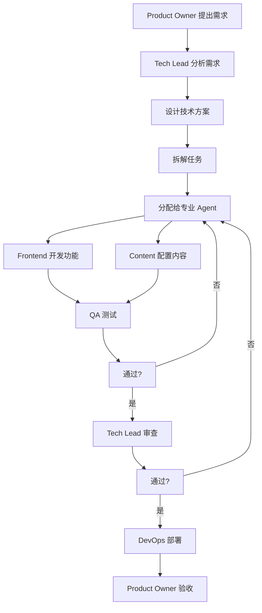
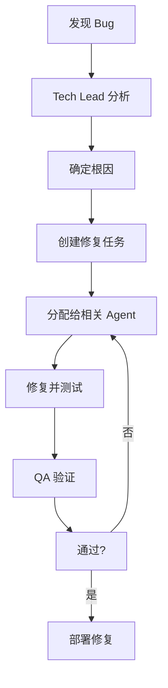
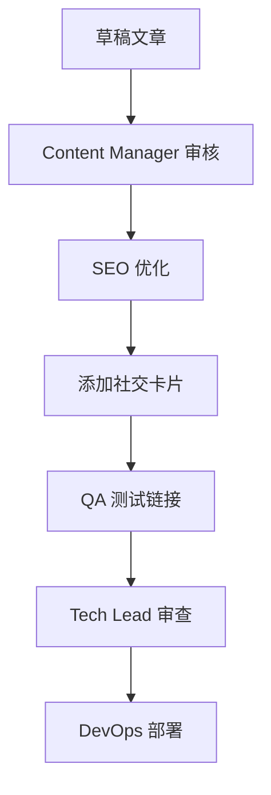

# Astro Blog Agent Team 配置

## 项目信息

```yaml
project:
  name: astro-blog
  type: static-blog
  framework: Astro 5.16.12
  version: 0.0.1
  location: ~/astro-blog
```

---

## Agent Team 架构

### 核心角色

```
┌─────────────────────────────────────────────────────────┐
│                    Product Owner                         │
│                     (人类 - 你)                           │
│              设定方向、验收成果、决策                       │
└─────────────────────────────────────────────────────────┘
                            ↓
┌─────────────────────────────────────────────────────────┐
│                   Tech Lead (Planner)                    │
│              技术架构设计、任务规划、代码审查               │
└─────────────────────────────────────────────────────────┘
                            ↓
        ┌──────────────────┼──────────────────┐
        ↓                  ↓                  ↓
┌──────────────┐  ┌──────────────┐  ┌──────────────┐
│ Frontend     │  │ Content      │  │ DevOps       │
│ Developer    │  | Manager      │  │ Engineer     │
└──────────────┘  └──────────────┘  └──────────────┘
        ↑                  ↑                  ↑
        └──────────────────┼──────────────────┘
                           ↓
                  ┌──────────────┐
                  │ QA & Testing │
                  │   Agent      │
                  └──────────────┘
```

---

## Agent 定义

### 1. Tech Lead (技术负责人)

**职责:**
- 技术架构设计
- 任务拆解和规划
- 代码审查
- 技术难点攻关
- 团队协调

**技能栈:**
- Astro/React 深度理解
- TypeScript 类型系统
- 性能优化最佳实践
- SEO 优化
- 可访问性 (a11y)

**工作模式:**
```
收到任务 → 技术分析 → 拆解为子任务 → 分配给专业 Agent → 验收成果 → 汇报给 PO
```

---

### 2. Frontend Developer (前端开发)

**职责:**
- UI 组件开发
- 响应式布局
- 交互动效
- 状态管理
- 性能优化

**技能栈:**
- Astro Components
- React Hooks
- Tailwind CSS
- TypeScript
- 动画库 (Framer Motion 等)

**典型任务:**
```
- 新增组件 (搜索框、评论系统等)
- 优化现有组件性能
- 实现深色模式
- 添加交互动效
```

---

### 3. Content Manager (内容管理)

**职责:**
- 内容结构设计
- Markdown/MDX 处理
- SEO 内容优化
- 多语言支持 (i18n)
- 内容分发 (RSS、社交卡片)

**技能栈:**
- Astro Content Collections
- Markdown/MDX
- RSS 生成
- Open Graph
- 结构化数据 (JSON-LD)

**典型任务:**
```
- 设计内容 Schema
- 添加 RSS 订阅
- 优化文章 SEO
- 实现标签分类
- 添加社交分享卡片
```

---

### 4. DevOps Engineer (运维工程师)

**职责:**
- CI/CD 流程
- 自动化测试
- 部署配置
- 性能监控
- 构建优化

**技能栈:**
- GitHub Actions
- Docker
- Vercel/Netlify 部署
- Lighthouse CI
- Bundle 分析

**典型任务:**
```
- 配置 CI/CD
- 添加自动化测试
- 优化构建产物
- 配置 Lighthouse CI
- 设置部署流程
```

---

### 5. QA & Testing (质量保证)

**职责:**
- 测试用例设计
- E2E 测试
- 视觉回归测试
- 可访问性测试
- 性能测试

**技能栈:**
- Vitest
- Playwright
- axe-core (a11y)
- Lighthouse
- Percy (视觉测试)

**典型任务:**
```
- 编写单元测试
- 编写 E2E 测试
- 可访问性审计
- 性能基准测试
```

---

## 工作流程

### 1. 功能开发流程



### 2. Bug 修复流程



### 3. 内容发布流程



---

## 沟通协议

### Agent 间消息格式

```json
{
  "from": "agent-name",
  "to": "agent-name",
  "type": "task|request|report|feedback",
  "priority": "critical|high|normal|low",
  "task_id": "unique-id",
  "title": "简短描述",
  "description": "详细说明",
  "context": {
    "files": ["相关文件路径"],
    "dependencies": ["依赖的其他任务"],
    "acceptance_criteria": ["验收标准"]
  },
  "timestamp": "ISO 8601 时间戳"
}
```

### 状态报告格式

```json
{
  "agent": "agent-name",
  "status": "in_progress|completed|blocked",
  "current_task": "当前任务",
  "completed_tasks": ["已完成任务"],
  "blocked_by": ["阻塞原因"],
  "next_steps": ["下一步计划"],
  "metrics": {
    "files_modified": 5,
    "tests_added": 3,
    "bugs_fixed": 1
  }
}
```

---

## 任务优先级规则

```
P0 - Critical (阻塞发布)
├── 生产环境 Bug
├── 安全漏洞
└── 数据丢失风险

P1 - High (重要功能)
├── 核心功能缺失
├── 性能严重退化
└── SEO 重大问题

P2 - Normal (常规迭代)
├── 新功能开发
├── 代码重构
└── 文档更新

P3 - Low (优化改进)
├── UI 细节优化
├── 代码清理
└── 技术债务
```

---

## 质量标准

### 代码质量

```yaml
typescript:
  strict_mode: true
  no_any: true
  coverage_target: 80%

eslint:
  rules: "airbnb-typescript"
  autofix: true

prettier:
  print_width: 100
  single_quote: true
  trailing_comma: "es5"
```

### 性能标准

```yaml
lighthouse:
  performance: 90+
  accessibility: 95+
  best_practices: 90+
  seo: 90+

build:
  max_js_size: "200KB (gzipped)"
  max_css_size: "50KB (gzipped)"
```

### SEO 标准

```yaml
required_meta:
  - title
  - description
  - og:title
  - og:description
  - og:image
  - twitter:card
  - canonical_url

lighthouse_seo: 90+
```

---

## 决策权限

| Agent | 可决策范围 | 需审批 |
|-------|-----------|--------|
| **Tech Lead** | 技术方案、代码风格、架构 | ❌ |
| **Frontend** | UI 实现、交互细节 | ❌ |
| **Content** | 内容结构、SEO 配置 | ❌ |
| **DevOps** | 部署流程、CI 配置 | ❌ |
| **QA** | 测试标准、验收 | ❌ |
| **Product Owner** | 功能优先级、发布决策 | ✅ |

---

## 工具集成

```yaml
version_control:
  platform: "GitHub"
  branch_strategy: "main + feature/*"
  pr_template: ".github/PULL_REQUEST_TEMPLATE.md"

ci_cd:
  platform: "GitHub Actions"
  tests_on_pr: true
  deploy_on_merge: true

monitoring:
  lighthouse_ci: true
  uptime_monitoring: false

project_management:
  tool: "GitHub Projects + Issues"
  epic_template: ".github/EPIC_TEMPLATE.md"
```

---

## 启动 Agent Team

```bash
# 在 astro-blog 目录启动
cd ~/astro-blog
tmf  # 全栈开发场景

# 或使用专用 Agent Team 场景
tma  # Agent Team 监控布局
```

---

## 快速命令

```bash
# 查看当前任务
cat ~/.claude/tasks/current.json

# 查看所有 Agent 状态
tmux a -t astro-blog-agents

# 生成任务报告
~/.claude/scripts/generate-report.sh
```
