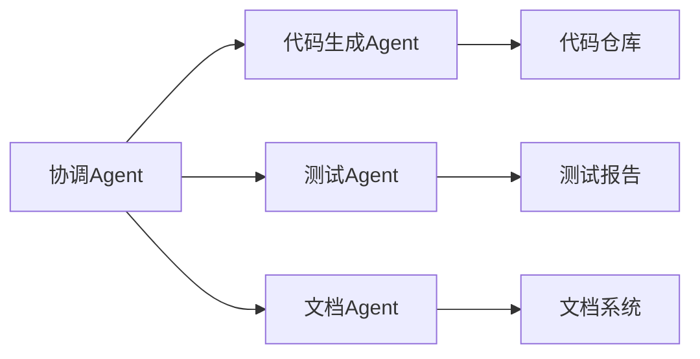

# Agent架构与多智能体协作：2026年的AI开发范式

在2026年，单一大语言模型（LLM）的应用已经逐渐让位于更先进的**Agent架构**和多智能体协作系统。这种转变标志着AI开发进入了一个全新的范式。

## 从LLM到Agent的演进

传统的LLM应用模式存在明显局限：

- **无状态性**：每次请求都是独立的，无法保持上下文记忆
- **被动响应**：只能回答问题，无法主动规划和执行任务
- **单线程处理**：缺乏并行处理复杂任务的能力

Agent架构通过引入以下核心组件解决了这些问题：

```typescript
interface Agent {
  // 1. 思维链规划
  plan(goal: string): Task[]

  // 2. 工具调用能力
  execute(tool: Tool, params: any): Promise<Result>

  // 3. 记忆系统
  memory: {
    shortTerm: ConversationHistory
    longTerm: VectorDatabase
  }

  // 4. 自我反思
  reflect(result: Result): Promise<Feedback>
}
```

## 多智能体协作模式

### 1. 职责分离模式

不同Agent负责不同专业领域，通过消息传递协作：



**实际应用场景**：代码审查系统

```typescript
// 协调Agent分配任务
const coordinator = new CoordinatorAgent()
const codeReview = await coordinator.assignTask({
  type: 'code-review',
  payload: { repo: 'project-x', pr: '#123' }
})

// 专业Agent并行工作
const [security, performance, style] = await Promise.all([
  new SecurityAgent().analyze(codeReview),
  new PerformanceAgent().analyze(codeReview),
  new StyleAgent().analyze(codeReview)
])
```

### 2. 层级架构模式

高层级Agent制定战略，低层级Agent负责执行细节：

```typescript
class HierarchicalAgent {
  async execute(goal: string) {
    // 战略规划层
    const strategy = await this.strategicPlanner.plan(goal)

    // 战术执行层
    const tactics = await this.tacticalExecutor分解(strategy)

    // 操作执行层
    const results = await Promise.all(
      tactics.map(t => this.operatorAgent.execute(t))
    )

    return this.synthesizer.integrate(results)
  }
}
```

### 3. 对抗式协作模式

两个Agent互相挑战和验证，提高输出质量：

```typescript
class AdversarialReview {
  async analyze(content: string) {
    const proponent = new ProponentAgent()
    const opponent = new CriticAgent()

    let round = 0
    let consensus = false

    while (!consensus && round < 5) {
      const argument = await proponent.argue(content)
      const critique = await opponent.critique(argument)

      consensus = await this.judge.evaluate(argument, critique)
      round++
    }

    return consensus ? argument : await this.arbitrator.resolve(argument, critique)
  }
}
```

## Web应用中的Agent实现

### 1. 前端Agent架构

使用Web Worker和IndexDB实现客户端Agent：

```typescript
// 主线程
class WebAgentRuntime {
  private workers: Map<string, Worker> = new Map()

  async spawnAgent(type: AgentType, config: Config) {
    const worker = new Worker(`/agents/${type}.js`)
    const memory = await this.initMemory(config.memory)

    worker.postMessage({ type: 'init', config, memory })

    const agent = new AgentProxy(worker)
    this.workers.set(agent.id, agent)

    return agent
  }
}

// Worker线程 (agent-code-generator.js)
self.onmessage = async (e) => {
  const { type, data } = e.data

  switch (type) {
    case 'init':
      this.agent = new CodeGeneratorAgent(data.config)
      this.memory = new IndexedDBMemory(data.memory)
      break
    case 'task':
      const result = await this.agent.execute(data.task)
      self.postMessage({ type: 'result', data: result })
      break
  }
}
```

### 2. 流式响应与渐进式输出

```typescript
class StreamingAgent {
  async *generate(prompt: string) {
    const stream = await this.llm.stream(prompt)

    for await (const chunk of stream) {
      // 实时思考过程
      if (chunk.type === 'thought') {
        yield { type: 'thinking', content: chunk.content }
      }

      // 工具调用
      if (chunk.type === 'tool_call') {
        const result = await this.tools[chunk.tool](chunk.params)
        yield { type: 'tool_result', tool: chunk.tool, result }

        // 将结果反馈给LLM
        continue
      }

      // 最终输出
      if (chunk.type === 'content') {
        yield { type: 'content', content: chunk.content }
      }
    }
  }
}
```

## Agent的关键能力

### 1. 工具使用（Tool Use）

```typescript
interface Tool {
  name: string
  description: string
  schema: z.ZodType<any>
  execute: (params: any) => Promise<any>
}

class ToolRegistry {
  private tools: Map<string, Tool> = new Map()

  register(tool: Tool) {
    this.tools.set(tool.name, tool)
  }

  async call(name: string, params: any) {
    const tool = this.tools.get(name)
    const validated = tool.schema.parse(params)
    return await tool.execute(validated)
  }
}

// 示例工具
const browserTool: Tool = {
  name: 'browser',
  description: '执行浏览器自动化操作',
  schema: z.object({
    action: z.enum(['click', 'type', 'scroll']),
    selector: z.string(),
    value: z.string().optional()
  }),
  async execute({ action, selector, value }) {
    return await playwright[action](selector, value)
  }
}
```

### 2. 记忆管理

```typescript
class HybridMemory {
  private shortTerm: CircularBuffer = new CircularBuffer(100)
  private longTerm: VectorDB = new ChromaDB('agent-memory')

  async store(key: string, content: string, metadata: any) {
    // 短期记忆 - 快速访问
    this.shortTerm.push({ key, content, metadata, timestamp: Date.now() })

    // 长期记忆 - 语义搜索
    const embedding = await this.embed(content)
    await this.longTerm.insert({ key, embedding, metadata })
  }

  async retrieve(query: string, limit = 10) {
    // 先查短期记忆
    const recent = this.shortTerm.search(query)

    // 再查长期记忆
    const embedding = await this.embed(query)
    const relevant = await this.longTerm.similaritySearch(embedding, limit)

    return [...recent, ...relevant].slice(0, limit)
  }

  async reflect() {
    // 定期将重要的短期记忆转移到长期记忆
    const important = this.shortTerm.filter(item => item.metadata.importance > 0.8)
    for (const item of important) {
      await this.store(item.key, item.content, item.metadata)
    }
  }
}
```

### 3. 任务规划

```typescript
class TaskPlanner {
  async plan(goal: string, context: Context): Promise<Task[]> {
    // 分解复杂目标
    const subtasks = await this.llm.complete(`
      目标: ${goal}
      上下文: ${JSON.stringify(context)}

      请将目标分解为可执行的子任务列表，每个任务包括：
      - 任务描述
      - 依赖关系
      - 所需工具
      - 预期输出
    `)

    const tasks = this.parseTasks(subtasks)

    // 构建任务依赖图
    const graph = this.buildDependencyGraph(tasks)

    // 拓扑排序获取执行顺序
    return this.topologicalSort(graph)
  }

  async executePlan(tasks: Task[]): Promise<Result[]> {
    const results: Result[] = []
    const completed = new Set<string>()

    while (completed.size < tasks.length) {
      // 找到可以并行执行的任务
      const ready = tasks.filter(task =>
        task.dependencies.every(dep => completed.has(dep))
      )

      // 并行执行
      const batchResults = await Promise.allSettled(
        ready.map(task => this.executeTask(task))
      )

      for (const result of batchResults) {
        if (result.status === 'fulfilled') {
          results.push(result.value)
          completed.add(result.value.taskId)
        } else {
          await this.handleFailure(result.reason)
        }
      }
    }

    return results
  }
}
```

## 实战案例：智能代码助手

让我们构建一个完整的代码Agent系统：

```typescript
class CodeAssistantAgent {
  private memory: HybridMemory
  private tools: ToolRegistry
  private planner: TaskPlanner

  async refactor(code: string, requirements: string) {
    // 1. 分析代码
    const analysis = await this.analyzeCode(code)

    // 2. 制定重构计划
    const plan = await this.planner.plan(requirements, { code, analysis })

    // 3. 执行重构
    const results = await this.planner.executePlan(plan)

    // 4. 验证结果
    const validation = await this.validateResults(results)

    if (!validation.passed) {
      // 自我修正
      return await this.refactor(code, requirements + '\n' + validation.feedback)
    }

    return results
  }

  private async analyzeCode(code: string) {
    return await Promise.all([
      this.tools.call('analyze_complexity', { code }),
      this.tools.call('detect_smells', { code }),
      this.tools.call('security_scan', { code })
    ])
  }

  private async validateResults(results: Result[]) {
    return await this.tools.call('run_tests', {
      changes: results.map(r => r.diff).join('\n')
    })
  }
}
```

## 性能优化策略

### 1. Agent池化

```typescript
class AgentPool {
  private agents: Map<string, AgentInstance[]> = new Map()
  private config: PoolConfig

  async acquire(type: string): Promise<AgentInstance> {
    const pool = this.agents.get(type) || []
    const available = pool.find(a => a.status === 'idle')

    if (available) {
      available.status = 'busy'
      return available
    }

    // 创建新实例
    const agent = await this.createAgent(type)
    agent.status = 'busy'
    pool.push(agent)
    this.agents.set(type, pool)

    return agent
  }

  release(agent: AgentInstance) {
    agent.status = 'idle'
    agent.reset() // 重置上下文
  }
}
```

### 2. 缓存与重用

```typescript
class CacheLayer {
  private cache: LRUCache<string, AgentResponse>
  private embeddingCache: VectorCache

  async get(prompt: string): Promise<AgentResponse | null> {
    // 精确匹配
    const exact = this.cache.get(prompt)
    if (exact) return exact

    // 语义相似匹配
    const embedding = await this.embed(prompt)
    const similar = await this.embeddingCache.search(embedding, 0.95)

    return similar || null
  }

  async set(prompt: string, response: AgentResponse) {
    this.cache.set(prompt, response)

    const embedding = await this.embed(prompt)
    await this.embeddingCache.store(embedding, response)
  }
}
```

## 未来展望

2026年的Agent架构将呈现以下趋势：

1. **自主性增强**：从工具调用者变为目标驱动者
2. **跨平台协作**：Web、移动、桌面Agent无缝协作
3. **个性化学习**：每个Agent都根据用户行为定制
4. **联邦学习**：分布式Agent共享知识而不泄露隐私

## 总结

Agent架构和多智能体协作代表了AI应用开发的下一个阶段。通过合理的设计和实现，我们可以构建出更智能、更可靠、更高效的AI系统。

在2026年，掌握Agent开发将成为AI工程师的核心竞争力。现在就开始学习和实践吧！
